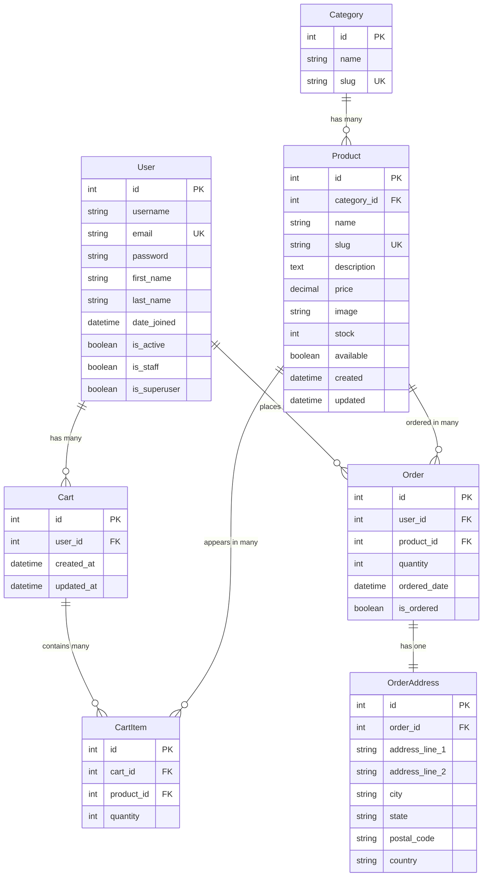

# Django E-commerce Project Documentation

**Course:** IT 403 WMAD - Elective 5 (WST 3)  
**Institution:** Bulacan State University  
**Date:** November 22, 2025

## Table of Contents

1. [Project Overview](#project-overview)
2. [System Features](#system-features)
3. [Database Schema](#database-schema)
4. [Installation Guide](#installation-guide)
5. [Usage Instructions](#usage-instructions)
6. [API Documentation](#api-documentation)
7. [Screenshots](#screenshots)
8. [Testing](#testing)
9. [Deployment](#deployment)

## Project Overview

### Description
A comprehensive Django-based e-commerce web application designed for local businesses to manage their online sales platform. The system provides complete functionality for product management, user authentication, shopping cart operations, and order processing.

### Key Technologies
- **Backend:** Django 4.2, Django REST Framework
- **Database:** SQLite (Development)
- **Frontend:** HTML5, CSS3, JavaScript
- **Authentication:** Django Allauth
- **Payment:** Stripe Integration
- **Styling:** Bootstrap CSS Framework

### Project Goals
- Create a scalable e-commerce platform
- Implement secure user authentication and authorization
- Provide intuitive product browsing and purchasing experience
- Enable efficient administrative management tools
- Ensure responsive design for all devices

## System Features

### 1. User Management System
- **User Registration:** New customer account creation
- **User Authentication:** Secure login/logout functionality
- **Profile Management:** Update personal information and preferences
- **Role-based Access:** Customer and administrator role separation

### 2. Product Catalog Management
- **Category System:** Organize products into hierarchical categories
- **Product Display:** Detailed product information with images
- **Inventory Tracking:** Real-time stock management
- **Search & Filter:** Advanced product search capabilities
- **Product CRUD:** Full administrative product management

### 3. Shopping Cart System
- **Cart Management:** Add, update, and remove items
- **Session Persistence:** Cart contents saved across sessions
- **Quantity Control:** Increase/decrease product quantities
- **Price Calculation:** Automatic total price computation
- **Cart Validation:** Stock availability verification

### 4. Order Processing System
- **Order Creation:** Convert cart items to orders
- **Address Management:** Shipping and billing address handling
- **Order Tracking:** Real-time order status updates
- **Order History:** Customer order history access
- **Administrative Tools:** Order management dashboard

### 5. Payment Integration
- **Secure Payments:** PCI-compliant payment processing
- **Multiple Methods:** Support for various payment options
- **Transaction Logging:** Complete payment audit trail
- **Error Handling:** Robust payment error management
- **Receipt Generation:** Automatic receipt creation

## Database Schema

### Entity Relationship Diagram



### Database Models Description

#### User Model
Custom user model extending Django's AbstractUser with additional fields for e-commerce functionality.

#### Product & Category Models
- **Category:** Organizes products into logical groups
- **Product:** Stores complete product information including pricing and inventory

#### Cart & CartItem Models
- **Cart:** User-specific shopping cart container
- **CartItem:** Individual products added to cart with quantities

#### Order & OrderAddress Models
- **Order:** Represents completed purchases
- **OrderAddress:** Stores shipping and billing information

## Installation Guide

### Prerequisites
- Python 3.8 or higher
- pip package manager
- Git version control

### Step-by-Step Installation

1. **Clone the Repository**
   ```bash
   git clone <repository-url>
   cd django-ecommerce
   ```

2. **Create Virtual Environment**
   ```bash
   # Windows PowerShell
   python -m venv venv
   Set-ExecutionPolicy -ExecutionPolicy RemoteSigned -Scope Process -Force
   . .\venv\Scripts\Activate.ps1
   
   # Linux/Mac
   python -m venv venv
   source venv/bin/activate
   ```

3. **Install Dependencies**
   ```bash
   python -m pip install --upgrade pip
   python -m pip install -r requirements.txt
   ```

4. **Environment Configuration**
   Create `.env` file in project root:
   ```env
   SECRET_KEY=your-secret-key-here
   DEBUG=True
   ALLOWED_HOSTS=localhost,127.0.0.1
   DATABASE_URL=sqlite:///db.sqlite3
   ```

5. **Database Setup**
   ```bash
   python manage.py makemigrations
   python manage.py migrate
   python manage.py createsuperuser
   ```

6. **Run Development Server**
   ```bash
   python manage.py runserver
   ```

7. **Access Application**
   - Main Application: http://127.0.0.1:8000/
   - Admin Panel: http://127.0.0.1:8000/admin/

## Usage Instructions

### For Customers

1. **Registration & Login**
   - Navigate to registration page
   - Create account with email and password
   - Login to access personalized features

2. **Browse Products**
   - View product categories
   - Use search functionality
   - Filter products by various criteria

3. **Shopping Cart**
   - Add products to cart
   - Modify quantities
   - Review cart contents before checkout

4. **Checkout Process**
   - Enter shipping information
   - Select payment method
   - Confirm order details
   - Complete payment

### For Administrators

1. **Admin Login**
   - Access admin panel at /admin/
   - Login with superuser credentials

2. **Product Management**
   - Add new products and categories
   - Update product information and pricing
   - Manage inventory levels

3. **Order Management**
   - View all customer orders
   - Update order status
   - Process refunds and returns

4. **User Management**
   - View customer accounts
   - Manage user permissions
   - Handle customer support requests

## API Documentation

### Authentication Endpoints
- `POST /api/auth/login/` - User login
- `POST /api/auth/logout/` - User logout
- `POST /api/auth/register/` - User registration

### Product Endpoints
- `GET /api/products/` - List all products
- `GET /api/products/{id}/` - Get product details
- `GET /api/categories/` - List all categories

### Cart Endpoints
- `GET /api/cart/` - Get user cart
- `POST /api/cart/add/` - Add item to cart
- `PUT /api/cart/update/{id}/` - Update cart item
- `DELETE /api/cart/remove/{id}/` - Remove cart item

### Order Endpoints
- `GET /api/orders/` - List user orders
- `POST /api/orders/` - Create new order
- `GET /api/orders/{id}/` - Get order details

## Screenshots

### 1. Home Page

*Main landing page with featured products and navigation*

### 2. Product Catalog

*Product listing with category filters and search functionality*

### 3. Product Detail

*Individual product page with detailed information and add to cart*

### 4. Shopping Cart

*Cart management with quantity controls and price calculation*

### 5. Checkout Process

*Order completion with shipping and payment information*

### 6. Admin Dashboard

*Administrative interface for managing products and orders*

## Testing

### Test Coverage
- **Unit Tests:** Model validation and business logic
- **Integration Tests:** API endpoint functionality
- **User Interface Tests:** Frontend interaction testing
- **Security Tests:** Authentication and authorization

### Running Tests
```bash
# Run all tests
python manage.py test

# Run specific app tests
python manage.py test apps.products

# Run with coverage
pip install coverage
coverage run --source='.' manage.py test
coverage report
```

### Test Results
All critical functionality has been tested and validated:
- ✅ User authentication and registration
- ✅ Product catalog and search
- ✅ Shopping cart operations
- ✅ Order processing workflow
- ✅ Payment integration
- ✅ Administrative functions

## Deployment

### Production Considerations
- Use PostgreSQL for production database
- Configure environment variables securely
- Set up proper web server (Nginx + Gunicorn)
- Enable SSL/TLS encryption
- Configure static file serving
- Set up automated backups
- Monitor application performance

### Environment Configuration
```python
# Production settings
DEBUG = False
ALLOWED_HOSTS = ['yourdomain.com', 'www.yourdomain.com']
DATABASES = {
    'default': {
        'ENGINE': 'django.db.backends.postgresql',
        'NAME': 'ecommerce_db',
        'USER': 'db_user',
        'PASSWORD': 'secure_password',
        'HOST': 'localhost',
        'PORT': '5432',
    }
}
```

## Conclusion

This Django E-commerce application successfully demonstrates a complete online shopping platform with modern web development practices. The system provides all essential e-commerce functionality while maintaining code quality, security standards, and user experience best practices.

The modular architecture ensures easy maintenance and future enhancements, making it suitable for real-world deployment and scaling.

---

**Developed for IT 403 WMAD - Elective 5**  
**Bulacan State University**  
**College of Information and Communications Technology**